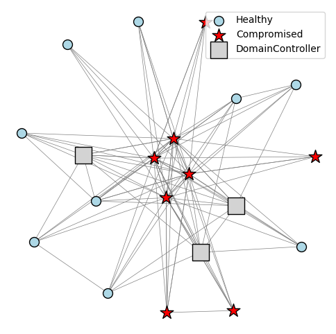

# CyGym

A **Cybersecurity Simulation Environment for Game-Theoretic Analysis**, developed as part of our GameSec 2025 submission.

---

## 📂 Repository Structure

- **`CDSimulatorComponents.py`**  
  Core building blocks: `Device`, `App`, `OperatingSystem`, `Workload`, `Vulnerability`, `Exploit`, `Subnet`, etc.

- **`CDSimulator.py`**  
  The main `CyberDefenseSimulator` class that ties together components, workload generation, network evolution, logging, and detection.

- **`CyberDefenseEnv.py`**  
  A Gym‐compatible RL environment wrapper around `CyberDefenseSimulator`.

- **`volt_typhoon_env.py`**  
  Subclass of `CyberDefenseEnv` implementing the Volt‐Typhoon attack scenario.

- **`simulatorGraph.py`**, **`simulatorTest.py`**  
  Diagnostic and visualization scripts for inspecting the simulator’s graph structure and component behavior.

- **`utils.py`**  
  Miscellaneous helper functions used by the agents and environment.

- **`do_agent.py`**  
  Implements Double‐Oracle (DOAR) training loops, best‐response DDPG agents, Nash‐solving, and payoff‐matrix management.

- **`volt_typhoon_do.py`**  
  Orchestrates the end-to-end Volt-Typhoon experiments: loading snapshots, running DOAR, tabular rollouts, and saving results in env_info.txt.

- **`init_experiments.py`**  
  (Optional) Script to generate and pickle a fixed network instance for reproducibility.

---

## 📊 Network Visualization

Below is an example network topology generated by the simulator:



---

## 🔧 Setup

1. **Clone this repository**  
   ```bash
   git clone https://github.com/your-org/cygym.git
   cd cygym
   ```

## 2. Download CVE data  
From [Kaggle: cygym-cve-csv](https://www.kaggle.com/datasets/mlanier/cygym-cve-csv), download and unzip the dataset, then **rename** and move the CSV into the repo root:

```bash
  kaggle datasets download -d mlanier/cygym-cve-csv
  unzip cygym-cve-csv.zip -d cygym-cve-csv
  mv cygym-cve-csv/CyGym_CVE.csv ./CVE.csv
```


## 3. Install Python dependencies

Make sure you have Python 3.8+ and `pip` installed, then run:

```bash
pip install -r requirements.txt
```

## 4. Initialize the simulator

Generate a fixed instance of the CDSimulator by running:

```bash
python init_experiments.py
```
This will create one or more initial_net_DO_its<N>.pkl snapshot files in your working directory (e.g. initial_net_DO_its1.pkl)


## 5. Run the Volt-Typhoon simulation

Once your environment is initialized and the snapshot (`initial_net_DO_its<N>.pkl`) is in place, launch the DOAR experiment:

```bash
python volt_typhoon_do.py \
  --seed 91 \
  --experiment_all \
  --its 2 \
  --do_DOAR \
  --BR_type "Cord_asc" \
  --tabular_results \
  --output_dir plots_2 \
  --workscale 1
```

